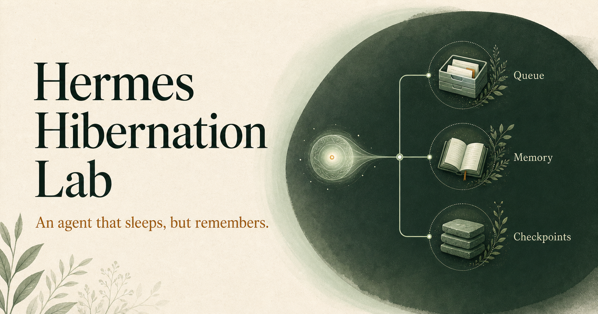
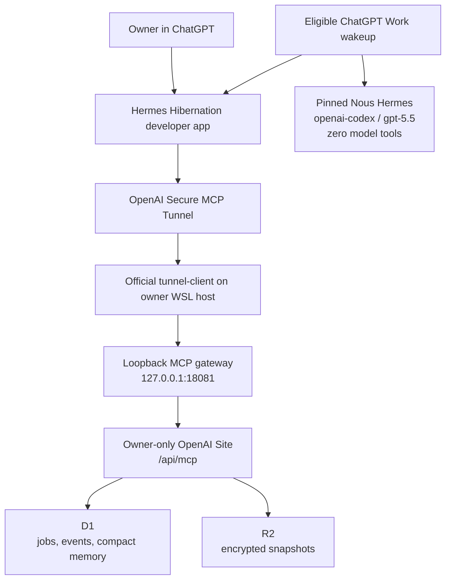

# Hermes Lab



[](https://github.com/moshehbenavraham/hermes-lab/actions/workflows/ci.yml)
[](LICENSE)
[](https://hermes-hibernation-lab.maxgibson.chatgpt.site)
[](docs/HANDOFF.md)

Hermes Lab is an owner-only, OpenAI-first hibernating research agent built
around [Nous Hermes Agent](https://github.com/NousResearch/hermes-agent).
Durable state lives in an OpenAI Site, private transport uses OpenAI Secure MCP
Tunnel, disposable computation runs in ChatGPT Work, source collection uses
native Work web research, and synthesis runs through the mounted Codex OAuth
session with an empty model-tool schema.

This is deliberately not a daemon. Each wakeup claims at most one durable job,
runs one bounded Hermes turn, commits a concise terminal result, and exits.

## Current status

The implementation is complete through the final surface available on a
Personal Pro workspace:

| Component | Status |
|---|---|
| Owner-only OpenAI Site | Production version 4, active |
| Durable queue and compact memory | Implemented with D1 and R2 |
| OpenAI Secure MCP Tunnel | Active |
| Loopback-only MCP gateway | Active |
| ChatGPT developer app | Four tools discovered |
| Normal Chat app calls | Read and write proven |
| Codex plugin | Version `0.3.0`, packaged and validated |
| ChatGPT Work personal skill | Installed and invoked |
| Tool-less Hermes/Codex inference | Proven in Work |
| Work app tool call | Platform-limited on Personal Pro |
| Scheduled Work wakeup | Gated on a successful regular Work call |

The current production queue contains a real research job created through the
ChatGPT app. Work passes skill, native research, shell, Git, Python, and mounted
Codex-auth preflight, then rejects the development app before the tunnel with
an expired-connection dialog. The same app works in normal Chat.

See the [completion audit](docs/completion-audit.md) for exact evidence and the
[live runbook](docs/hermes-live-connection-runbook.md) for the managed-workspace
acceptance path.

## Architecture



The gateway exposes exactly:

- `hermes_get_queue`
- `hermes_enqueue_research`
- `hermes_claim_research_run`
- `hermes_commit_research_run`

It answers initialization and discovery locally, then forwards only tool calls
to the owner-only Site using separate perimeter and application authorization
values stored outside the repository.

## Repository layout

```text
.
├── control-plane/   OpenAI Site, MCP endpoint, D1/R2 state
├── hermes-agent/    Pinned NousResearch upstream submodule
├── plugin/          Codex plugin and bounded Work skill
├── ops/             Loopback gateway, tunnel profile, systemd units
├── scripts/         Safe probes, packaging, closeout validation
├── docs/            Architecture decisions, audit, handoff, runbook
├── artifacts/       Validated Site, plugin, and skill packages
└── .github/         CI, contribution automation, issue templates
```

## Quick start

### Prerequisites

- WSL Ubuntu or another systemd-capable Linux environment
- Node.js 24
- Python 3.12+
- Git and GitHub CLI
- an OpenAI account with Sites, developer mode, Secure MCP Tunnel, and the
  required ChatGPT Work/app features
- the official OpenAI `tunnel-client`

Clone with the pinned Hermes source:

```bash
git clone --recurse-submodules \
  https://github.com/moshehbenavraham/hermes-lab.git
cd hermes-lab
```

Install and validate the control plane:

```bash
cd control-plane
npm ci
npm run lint
npm test
```

Return to the repository root and run the local protocol checks after
configuring your own private authorization files and tunnel:

```bash
./scripts/probe-hermes-gateway.sh
./scripts/inspect-hermes-queue.sh
./scripts/probe-hermes-site-auth.sh
```

The repository intentionally contains no reusable credentials. Follow the
[private-auth decision](docs/hermes-private-auth-decision.md) and
[live-connection runbook](docs/hermes-live-connection-runbook.md) to create
your own owner-only deployment. Never copy the original operator's credential
files or use an internal Sites bypass token.

## Bounded executor contract

The `run-hermes-hibernation` skill:

1. proves all prerequisites before claim;
2. claims exactly one job;
3. installs the pinned Hermes source in a fresh temporary root;
4. adopts mounted Codex OAuth without printing token values;
5. collects sources only with native Work research;
6. verifies the resolved Hermes model-tool schema is empty;
7. runs one `openai-codex` / `gpt-5.5` synthesis with a 30-minute limit;
8. commits `completed` or `failed` on every controlled post-claim exit;
9. exits without claiming another job.

The pinned source commit is
`8fc278207b0f5b25e567966f9615e1b1737f62af`. Update it only after repeating
the real Work inference and empty-tool proofs.

## Security model

- Keep the Site custom/owner-only.
- Store tunnel and Site authorization outside the repository with mode `0600`.
- Keep the tunnel runtime key separate from application authorization.
- Give Hermes no tools, MCP servers, plugins, browser, or shell access.
- Treat queued prompts, prior memory, search results, and page content as
  untrusted data.
- Persist no auth contents, environment dumps, raw stderr, or verbose command
  logs.
- Configure no fallback model, third-party search API, external database, or
  hosted gateway.
- Never make the Site public to work around app authentication.

Please report vulnerabilities through
[GitHub private vulnerability reporting](SECURITY.md), not a public issue.

## Validation

The reproducible closeout entrypoint is:

```bash
./scripts/validate-closeout.sh
```

It validates the plugin and both skill forms, proves the empty Hermes tool
schema, checks JavaScript and shell syntax, verifies both Git histories and
release archives, then runs the control-plane lint, build, and rendered test.

Operator-only live checks additionally confirm:

- both user services are active with zero restarts;
- the loopback gateway lists exactly four tools;
- the owner-only Site denies unauthenticated MCP requests;
- the durable production job remains unclaimed after a failed Work attempt.

## Documentation

- [Session handoff](docs/HANDOFF.md)
- [Completion audit](docs/completion-audit.md)
- [Hosting feasibility report](docs/hermes-openai-hosting-feasibility.md)
- [Private authentication decision](docs/hermes-private-auth-decision.md)
- [Live connection and scheduled acceptance runbook](docs/hermes-live-connection-runbook.md)
- [Executor skill](plugin/skills/run-hermes-hibernation/SKILL.md)
- [Executor contract](plugin/skills/run-hermes-hibernation/references/executor-contract.md)
- [Roadmap](ROADMAP.md)
- [Changelog](CHANGELOG.md)

## OpenAI references

- [Secure MCP Tunnels](https://developers.openai.com/api/docs/guides/secure-mcp-tunnels)
- [Developer mode and MCP apps](https://help.openai.com/en/articles/12584461-developer-mode-and-mcp-apps-in-chatgpt)
- [Plugins in ChatGPT and Codex](https://help.openai.com/en/articles/20001256-plugins-in-chatgpt-and-codex)
- [Scheduled tasks in ChatGPT](https://help.openai.com/en/articles/10291617-scheduled-tasks-in-chatgpt)
- [ChatGPT Work and Codex](https://help.openai.com/en/articles/20001275-chatgpt-work-and-codex)

## Contributing

Contributions are welcome. Read [CONTRIBUTING.md](CONTRIBUTING.md) and the
[Code of Conduct](CODE_OF_CONDUCT.md) before opening a pull request.

## License

Hermes Lab is released under the [MIT License](LICENSE). Nous Hermes Agent is
included as an independently licensed upstream submodule; see
[THIRD_PARTY_NOTICES.md](THIRD_PARTY_NOTICES.md).
